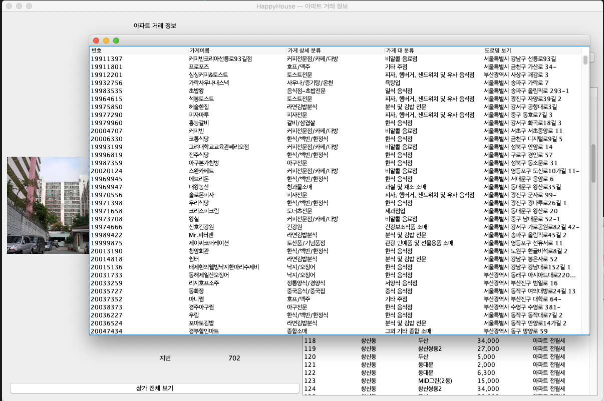

# 관통프로젝트: HappyHouse_Java_서울_07반_양동혁_최은송
### 제출일: 2021.02.24

### 참여 페어
- 최은송(조장), 양동혁

### 처리된 요구사항 목록
  
|난이도|구현기능|세부|작성여부(O/X)|
|:---:|---|---|:---:|
|기본|화면 UI + Service + DAO 완성|이벤트 처리| O |
|기본|화면 UI + Service + DAO 완성|Service 완성| O |
|기본|화면 UI + Service + DAO 완성|Dao 완성| O |
|기본|XML Parsing|아파트 전,월세 거래| O |
|기본|XML Parsing|주택 거래 XML| O |
|기본|전체 프로그램 동작|오류 없이 전체 동작| O |
|추가|추가 구현 기능|데이터와 일치한 환경 지도 점검내역 표시| O |
|심화|심화 구현 기능|상가 전체 보기 기능| O |

* 작성된 기능은 반드시 캡쳐되어야 합니다.(GUI 실행화면, 콘솔 출력 등) 
* 추가로 구현한 기능을 표에 추가시키세요.

### 실행화면 캡쳐 - 
TODO: 요구사항 목록에서 완료 처리된 사항의 캡쳐 이미지를 등록하세요.

구현 기능: 전체 프로그램 동작/동을 기준으로 검색 하는 기능

구현 기능: 전체 프로그램 동작/아파트를 기준으로 검색 하는 기능

구현 기능: 추가 구현 기능/데이터를 클릭하면 데이터와 일치하는 환경 지도 점검내역을 표시

구현 기능: 심화 구현 기능/상가 전체 보기를 하면 입력된 전체 상가의 데이터를 표시
