# 관통프로젝트: HappyHouse_FrontEnd_서울_08반_양동혁_김수연 
### 제출일: 2021.03.12

### 참여 페어
- 양동혁(조장), 김수연

### 처리된 요구사항 목록
  
|난이도|구현기능|세부|작성여부(O/X)|
|:---:|---|---|:---:|
|기본|메인페이지||O|
|기본|회원관리페이지|회원정보 등록화면|O|
|기본|회원관리페이지|회원정보 수정화면|O|
|기본|회원관리페이지|회원정보 삭제화면|O|
|기본|회원관리페이지|회원정보 검색화면|O|
|기본|로그인/로그아웃 페이지||O|
|기본|실거래가 검색,결과 페이지|전체검색화면|O|
|기본|실거래가 검색,결과 페이지|상세검색화면|O|
|기본|실거래가 검색,결과 페이지|동별화면|O|
|기본|실거래가 검색,결과 페이지|아파트별검색화면|O|
|추가|비밀번호찾기||O|
|추가|사이트맵구현||O|
|추가|메뉴구성||O|
|추가|관심지역 동네 업종 정보||O|
|추가|관심지역 대기 오염 정보||X|
|심화|웹사이트 소개 페이지||O|
|심화|공지사항관리 화면||O|
|||||
|추가기능| 동네 병원 및 코로나 선별소||O|

### 실행화면 캡쳐 - 
TODO: 요구사항 목록에서 완료 처리된 사항의 캡쳐 이미지를 등록하세요.

구현 기능: 메인페이지 - Nav, Logo, 메뉴, 주제, 지도, 표 구현  

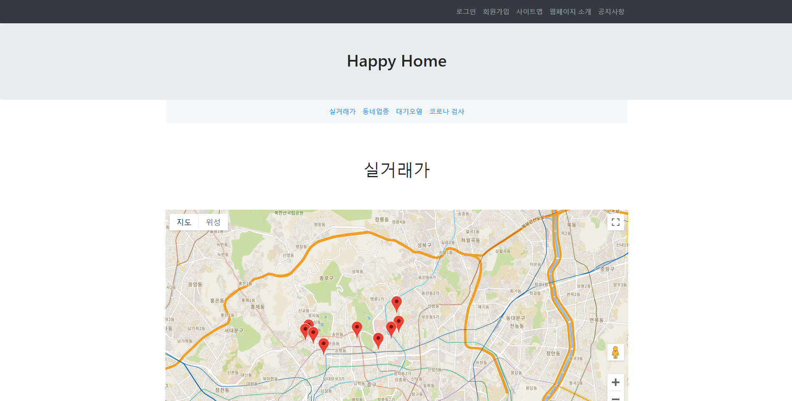

구현 기능: 회원관리페이지|회원정보 - personData.json에서 데이터를 가져와서 출력 

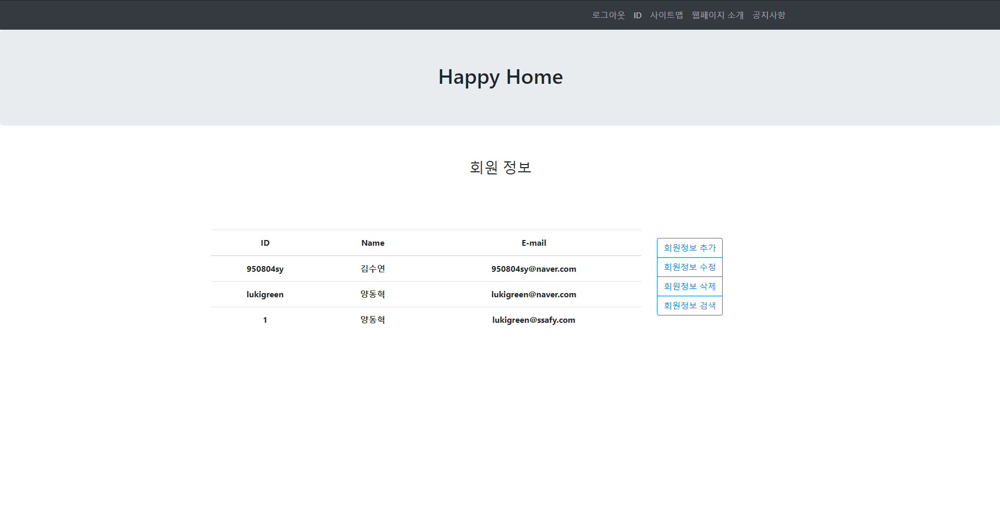

구현 기능: 회원관리페이지|회원정보 등록화면 - 회원가입 modal나옴 - 가입 가능한지 여부 파악가능 - 실제 데이터 연동X 

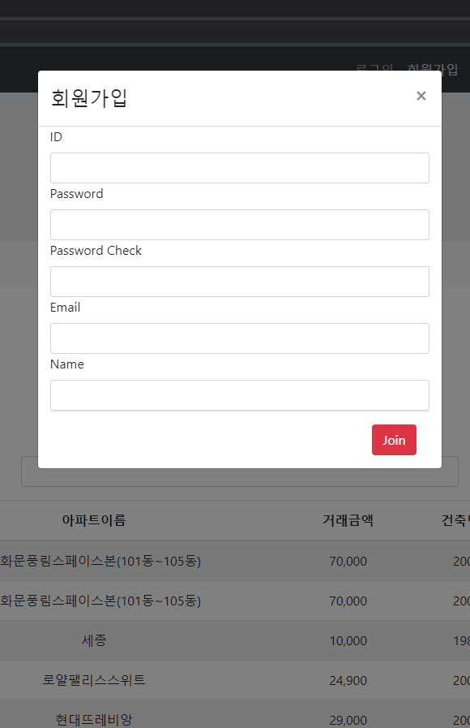

구현 기능: 회원관리페이지|회원정보 수정화면 - 회원정보 수정 modal나옴 - 데이터가 존재한지 파악가능 - 실제 데이터 연동X 

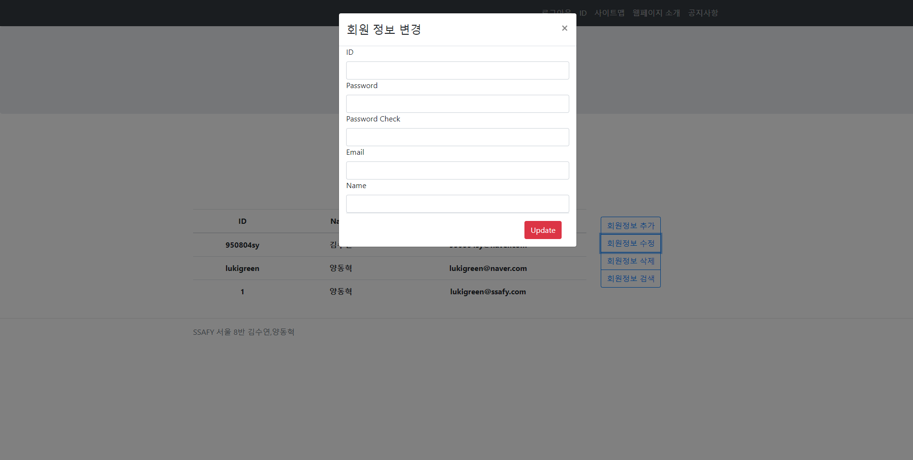

구현 기능: 회원관리페이지|회원정보 삭제화면 - 회원정보 삭제 modal나옴  - 데이터가 존재한지 파악가능- 실제 데이터 연동X 

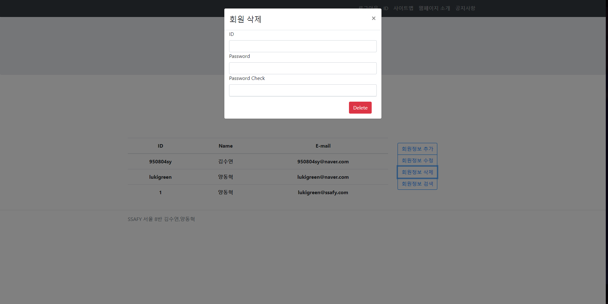

구현 기능: 회원관리페이지|회원정보 검색화면 - 회원정보 수정 modal나옴 - 실제 데이터 연동X 

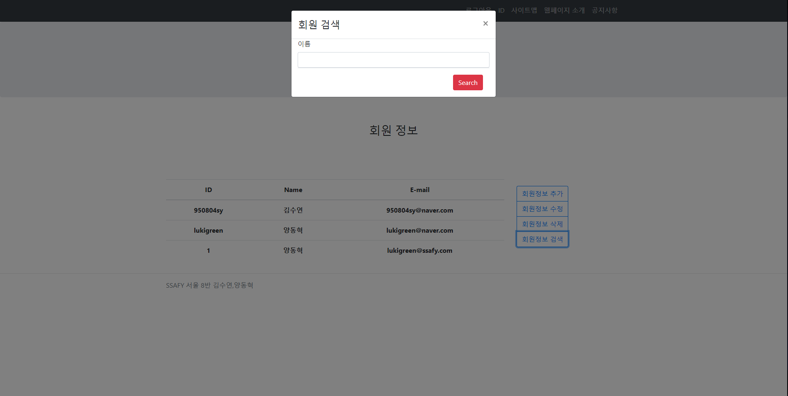

구현 기능: 로그인/로그아웃 페이지 - 로그인 페이지 존재, 로그아웃 클랙시 바로 로그아웃됨 

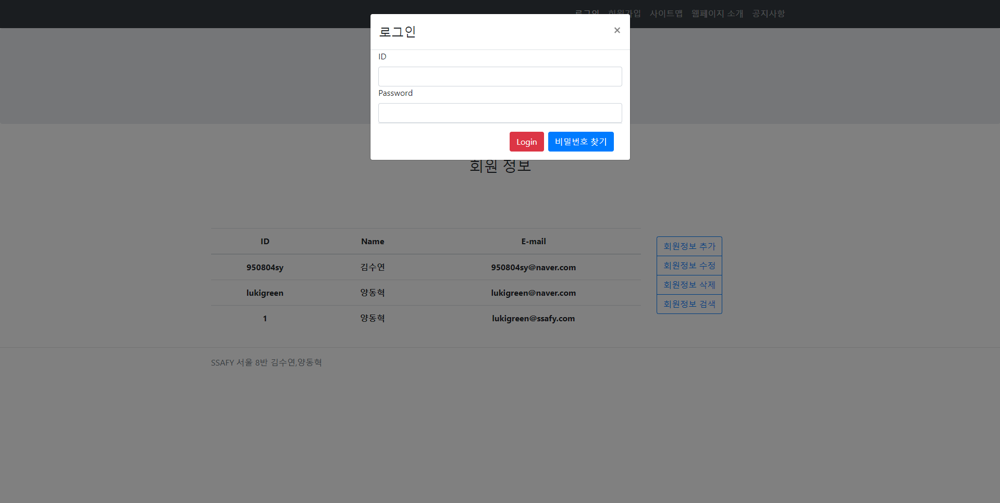

구현 기능: 실거래가 검색,결과 페이지|전체검색화면 - 전체 표 출력 

구현 기능: 실거래가 검색,결과 페이지|상세검색화면 - 거래종류에 따른 검색확인 

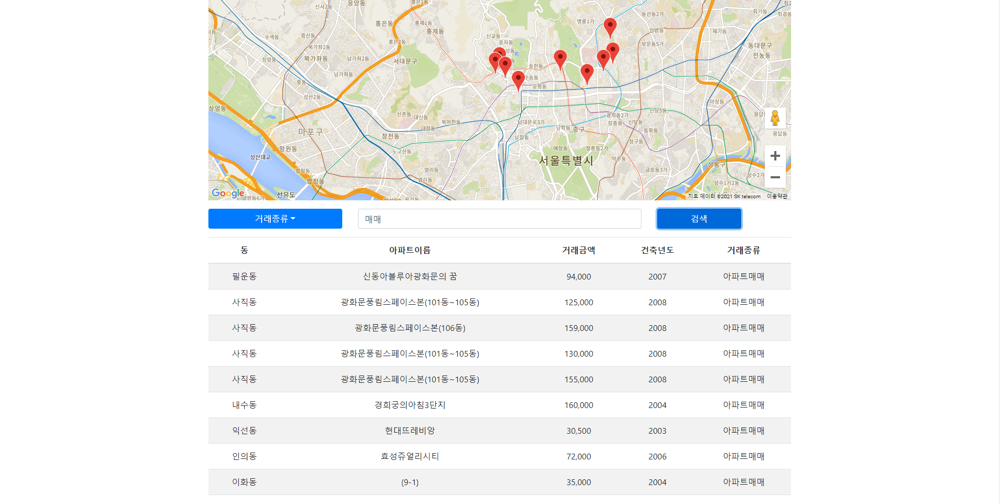

구현 기능: 실거래가 검색,결과 페이지|동별화면 - 지역에 따른 검색 확인 

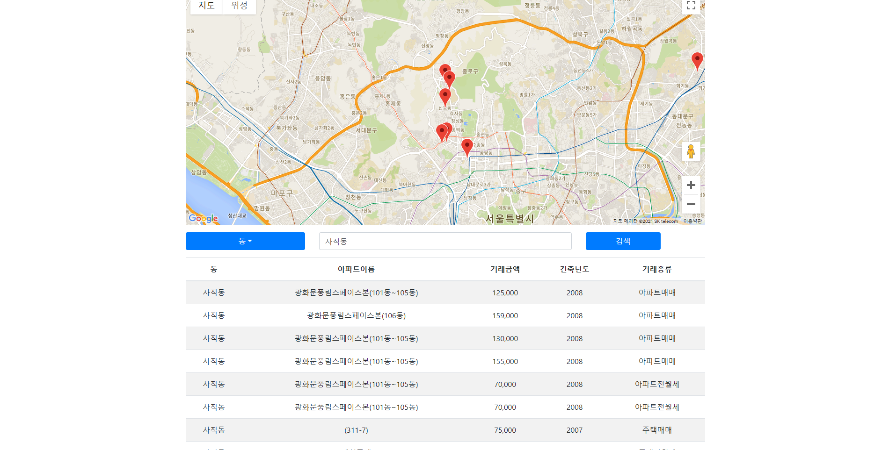

구현 기능: 실거래가 검색,결과 페이지|아파트별검색화면 - 아파트 이름별 검색 확인 

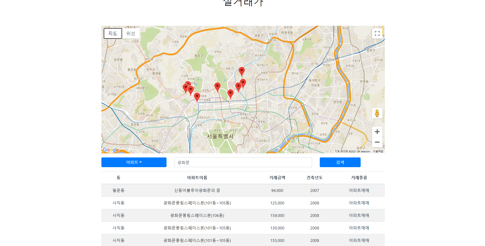

구현 기능: 추가|비밀번호찾기 - json데이터에서 가져와서 존재하면 비밀번호 출력 

구현 기능: 추가|사이트맵구현 - 사이트 대단락으로 이동가능 

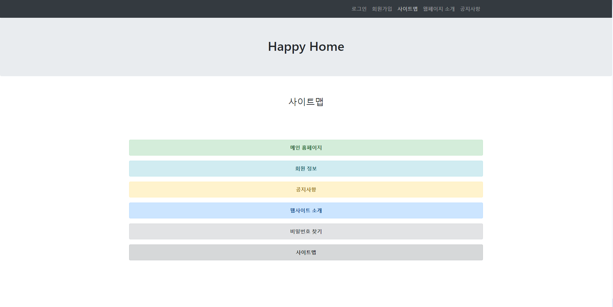

구현 기능: 추가|관심지역 동네 업종 정보 - 동네 업종으로 표 출력 

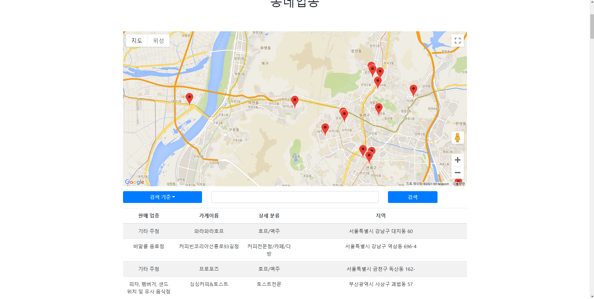

구현 기능: 심화|웹사이트 소개 페이지 - 중요 사이트 페이지 출력 

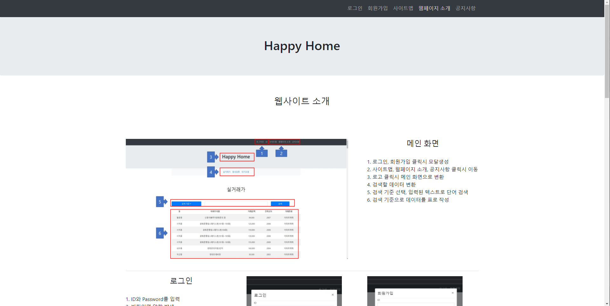

구현 기능: 심화|공지사항관리 화면 - 공지사항 사이트 표현, 글쓰기, 목록으로 서로 이동가능 

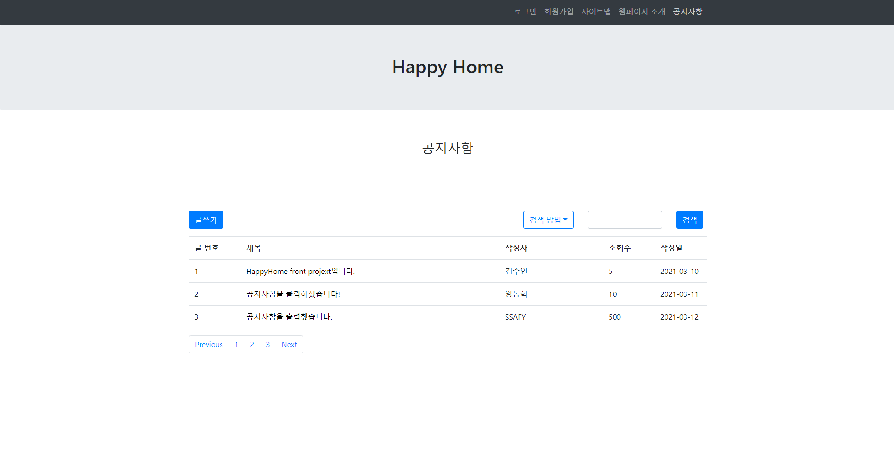

구현 기능: 추가 기능|공지사항관리 화면 - 공지사항 사이트 표현, 글쓰기, 목록으로 서로 이동가능 

