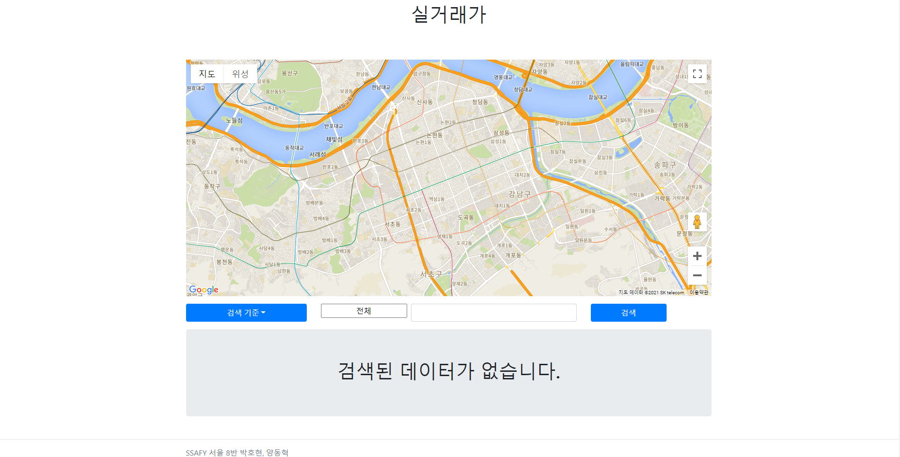
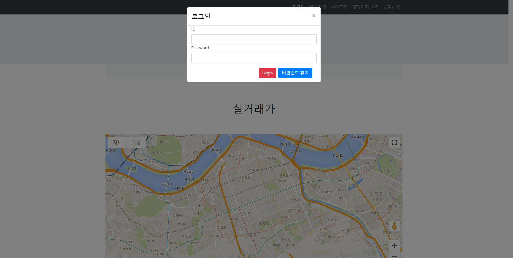
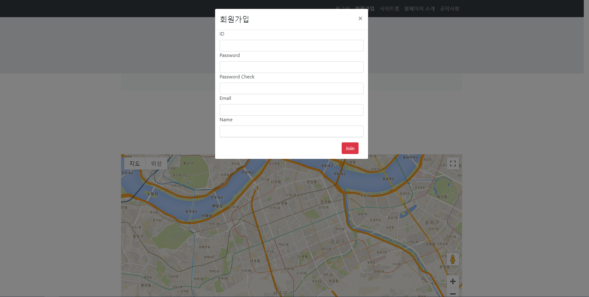
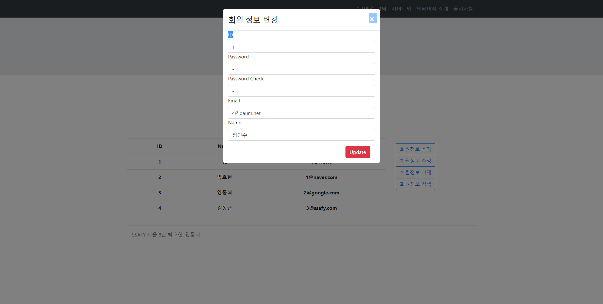
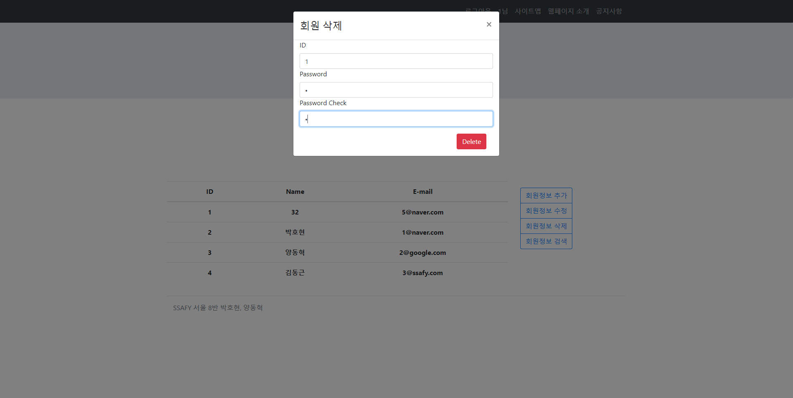
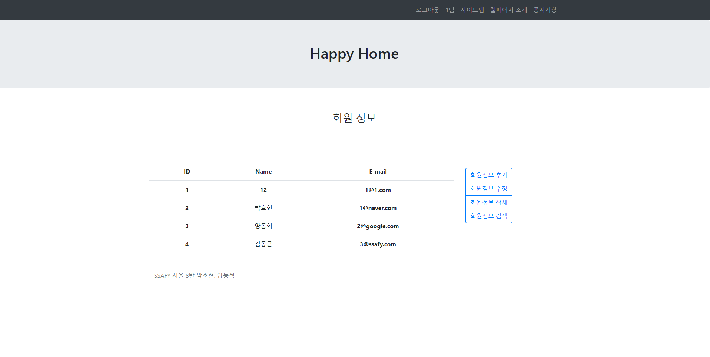
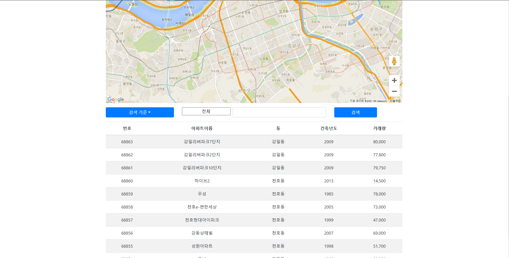

관통 프로젝트 제출 방법

# 관통프로젝트: HappyHouse_BackEnd_서울_08반_박호현_양동혁 
### 제출일: 2021.04.02

### 참여 페어
- 박호현, 양동혁(조장)

### 처리된 요구사항 목록
  
|난이도|구현기능|세부|개발자명|작성여부(O/X)|
|:---:|---|---|---|:---:|
|기본|메인페이지||양동혁|O|
|기본|회원관리페이지|회원정보 등록화면|박호현|O|
|기본|회원관리페이지|회원정보 수정화면|박호현|O|
|기본|회원관리페이지|회원정보 삭제화면|박호현|O|
|기본|회원관리페이지|회원정보 검색화면|박호현|O|
|기본|로그인/로그아웃 페이지||박호현|O|
|기본|실거래가 검색,결과 페이지|전체검색화면|양동혁|O|
|기본|실거래가 검색,결과 페이지|상세검색화면|양동혁|O|
|기본|실거래가 검색,결과 페이지|동별화면|양동혁|O|
|기본|실거래가 검색,결과 페이지|아파트별검색화면|양동혁|O|
|추가|비밀번호찾기|||X|
|추가|사이트맵구현|||X|
|추가|메뉴구성|||X|
|추가|관심지역 동네 업종 정보|||X|
|추가|관심지역 대기 오염 정보|||X|
|심화|웹사이트 소개 페이지|||X|
|심화|공지사항관리 화면|||X|

* 작성된 기능은 반드시 캡쳐되어야 합니다. 
* 추가로 구현한 기능을 표에 추가시키세요.

### 실행화면 캡쳐 - 
TODO: 요구사항 목록에서 완료 처리된 사항의 캡쳐 이미지를 등록하세요.

구현 기능: 메인 화면

구현 기능: FrontEnd + BackEnd(로그인)

구현 기능: FrontEnd + BackEnd(회원정보 등록화면, 회원가입)

구현 기능: FrontEnd + BackEnd(회원정보 수정화면)

구현 기능: FrontEnd + BackEnd(회원정보 삭제화면)

구현 기능: FrontEnd + BackEnd(회원정보 검색화면)

구현 기능: FrontEnd + BackEnd동별 검색 화면)

구현 기능: FrontEnd + BackEnd(아파트별 검색 화면)

