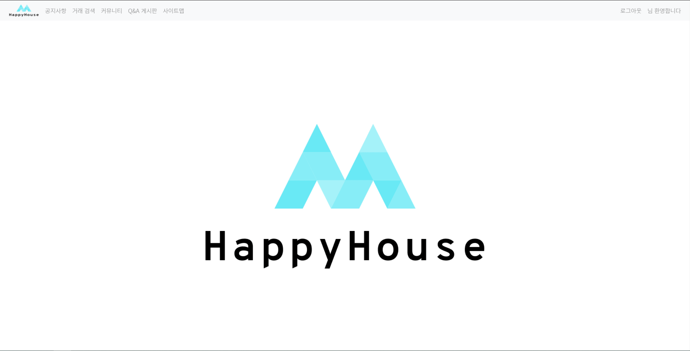
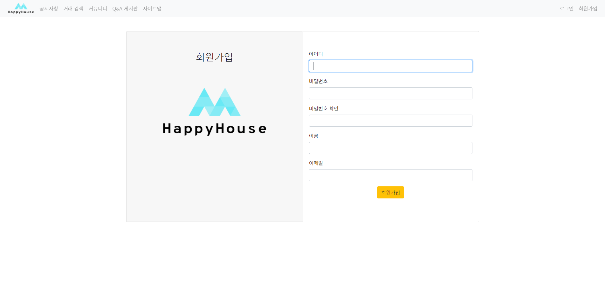
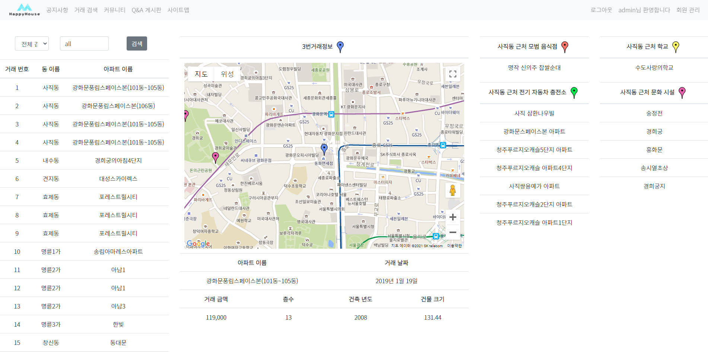
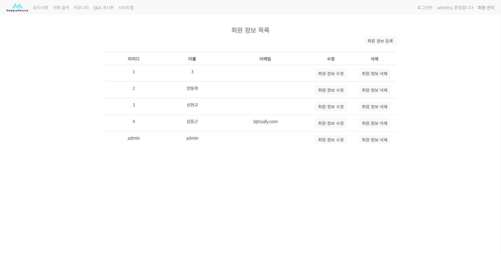
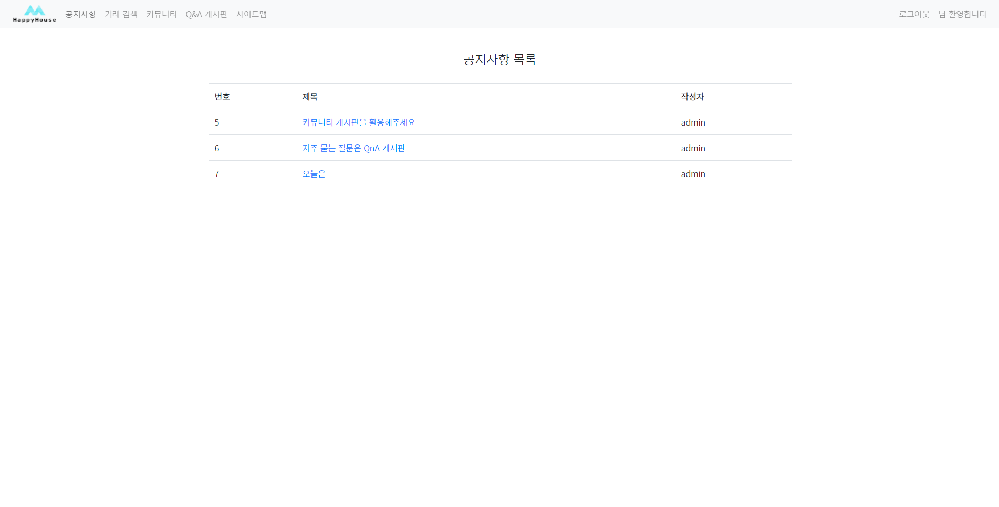
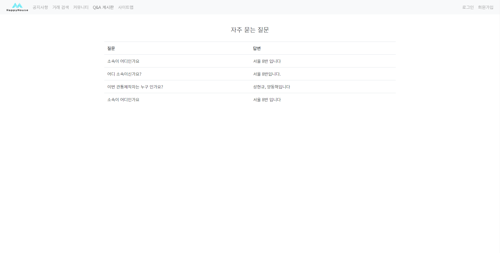
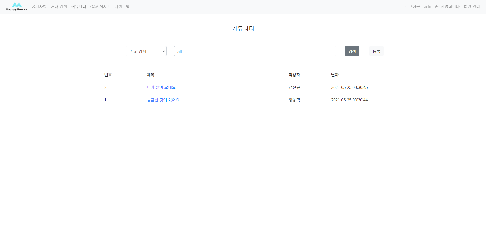
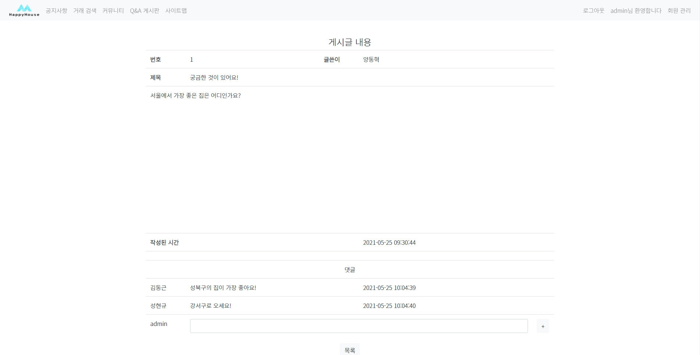

# HappyHouse
아파트 거래 매물 프로젝트
1. JAVA			 - <b> JAVA </b>
2. WEB			 - <b> html, css, javascript, jQuery, ajax, BootStrap</b>
3. Backend	 - <b> Servlet, JSTL, EL</b>
4. Spring    - <b> BootStrap, Spring Boot, MyBatis</b>
5. Final - <b> Spring Boot, Vuejs, MyBatis, MySQL </b> 

### 실행화면 캡쳐 - 
메인페이지 

 

로그인 

 

회원가입 

 

거래내역 

 

회원정보 

 

공지사항 

 

Q&A 게시판 

 

커뮤니티 

 

커뮤니티 게시글 

 
