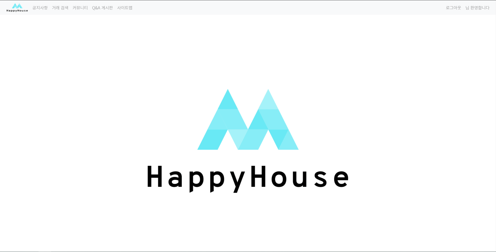
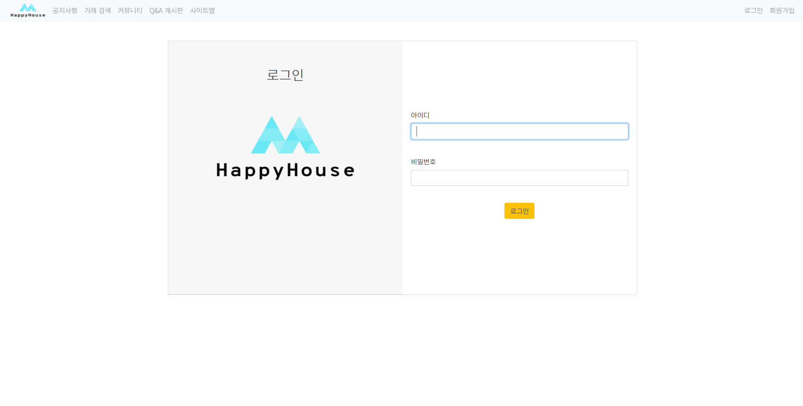
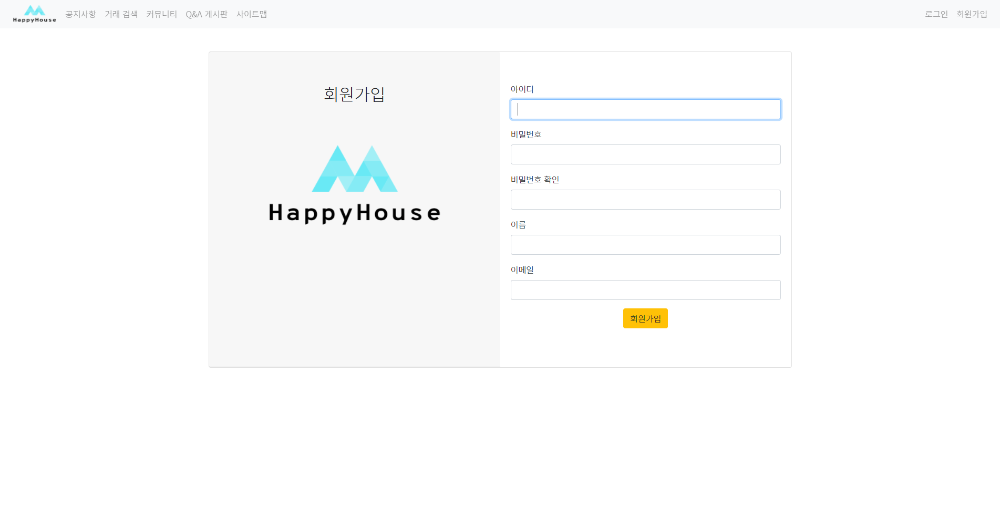
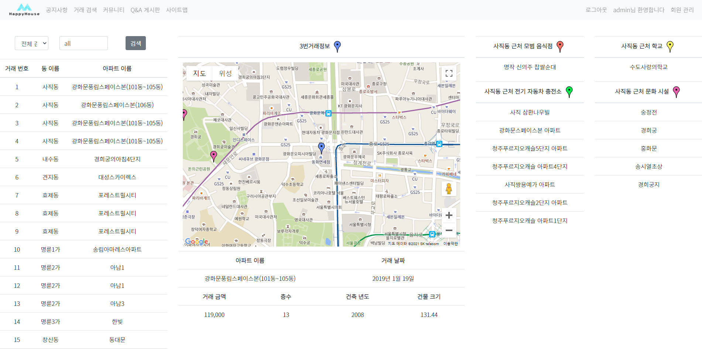
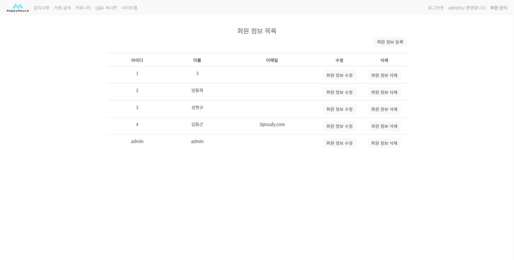
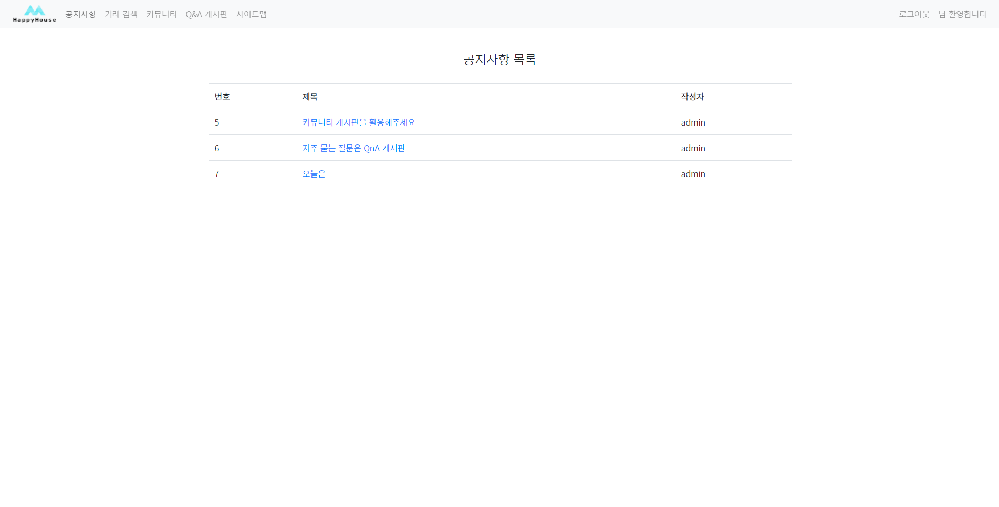
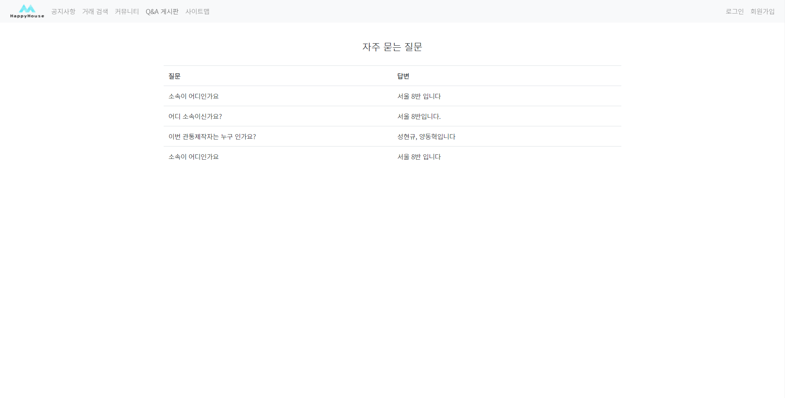
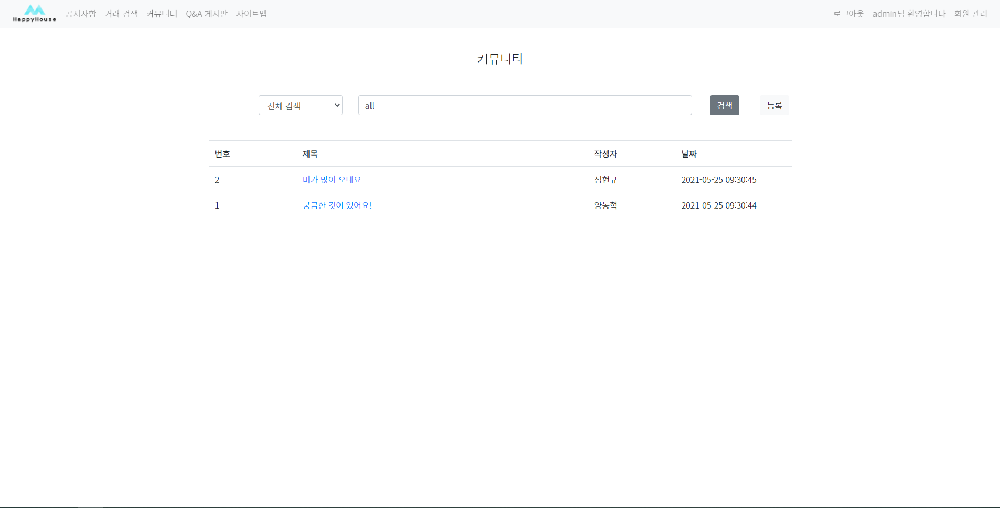
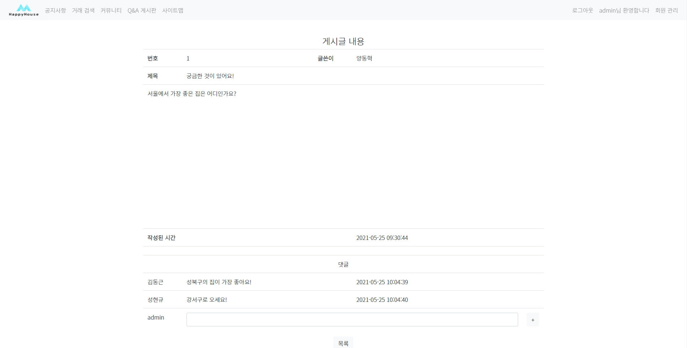

# HappyHouse
아파트 거래 매물 프로젝트
1. JAVA			 - <b> JAVA </b>
2. WEB			 - <b> html, css, javascript, jQuery, ajax, BootStrap</b>
3. Backend	 - <b> Servlet, JSTL, EL</b>
4. Spring    - <b> BootStrap, Spring Boot, MyBatis</b>
5. Final - <b> Spring Boot, Vuejs, MyBatis, MySQL </b> 

### 실행화면 캡쳐 - 
<b>메인페이지</b> 

 

<b>로그인</b> 

 

<b>회원가입</b> 

 

<b>거래내역</b> 

 

<b>회원정보</b> 

 

<b>공지사항</b> 

 

<b>Q&A 게시판</b> 

 

<b>커뮤니티</b> 

 

<b>커뮤니티 게시글</b> 

 
